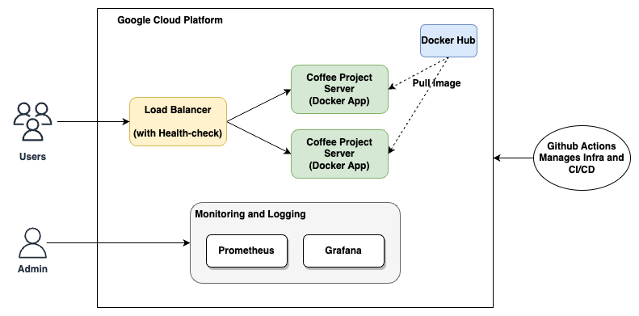
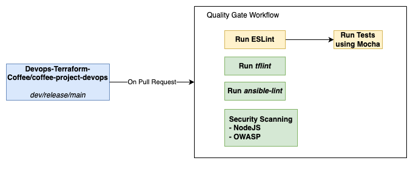
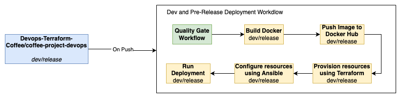
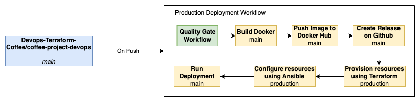

# _From Chaos to Control: Terraforming a New DevOps Era_

This repository contains scripts and configurations for setting up an automated DevOps pipeline leveraging Terraform, Ansible, Nginx, Prometheus, and Grafana.

## Working Demonstration

[](https://www.youtube.com/watch?v=HmnuikkLcec)


## Features

- **Automated Code Quality Checks:** Static code analysis and automated testing on pull requests for maintaining code quality standards.
- **Infrastructure Provisioning with Terraform:** Creation of three VMs - webserver, load balancer, and monitoring server with associated firewall configurations.
- **Server Configuration with Ansible:** Automated server setup, dependency installation, and application configurations across the infrastructure.
- **Health Checks and Monitoring:** Continuous monitoring of system metrics using Prometheus and visualization through Grafana dashboards.

## Getting Started

### Prerequisites

Setup a github runner (or your machine if running locally) with these dependencies:
- Terraform - [Installation Guide](https://www.terraform.io/downloads.html)
- Ansible - [Installation Guide](https://docs.ansible.com/ansible/latest/installation_guide/intro_installation.html)
- Docker - [Installation Guide](https://docs.docker.com/get-docker/)
- GCP account
- Docker Hub account

Find install scripts for Debian 11 [here](scripts/)


### Folder Structure
```bash
.
├── .dockerignore
├── .github
│   └── workflows
│       ├── deployment.yml
│       ├── docker_build.yml
│       ├── instance_setup.yml
│       ├── lint_ansible.yml
│       ├── lint_terraform.yml
│       ├── lint_test_coffee.yml
│       ├── nodejs_scan.yml
│       └── pr_resource_cleanup.yml
├── .gitignore
├── README.md
├── ansible
│   ├── Dockerfile
│   ├── README.md
│   ├── deployment.yaml
│   ├── grafana
│   │   ├── grafana.yaml
│   │   └── webserver_dashboard.json
│   ├── hosts.yaml
│   ├── load_balancer
│   │   ├── load-balancer.yaml
│   │   └── load_balancer.conf.j2
│   ├── nginx
│   │   ├── nginx.yaml
│   │   └── reverse_proxy.conf
│   ├── prometheus
│   │   ├── prometheus.yaml
│   │   └── prometheus.yaml.j2
│   └── webserver
│       └── webserver.yaml
├── coffee-project
│   ├── .eslintrc.json
│   ├── .gitignore
│   ├── README.md
│   ├── app.js
│   ├── data.js
│   ├── package-lock.json
│   ├── package.json
│   ├── public
│   │   ├── index.html
│   │   └── script.js
│   └── test
│       └── app.test.js
├── docker
│   ├── .dockerignore
│   ├── Dockerfile
│   ├── README.md
│   ├── compose-build.yml
│   └── compose-template.yml.j2
├── scripts
│   └── locustfile.py
└── terraform-files
    ├── .terraform.lock.hcl
    ├── README.md
    ├── main.tf
    ├── outputs.tf
    ├── terraform.tfvars
    └── variables.tf
```
### Github secrets
- DOCKER_USERNAME: Docker Hub username
- DOCKER_PASSWORD: Docker Hub password
- GOOGLE_CREDENTIALS: GCP credentials json file for service account
- PERSONAL_SECRET_TOKEN: Personal Access Token(PAT) from Github with repo access

### Running Locally
1. [Coffee-project setup](coffee-project/README.md)
2. [Build Docker image](docker/README.md)
3. [Instance provisioning using Terraform](terraform-files/README.md)
4. [Ansible deployment configuration](ansible/README.md)

### Architecture Diagram


### DevOps Pipeline



